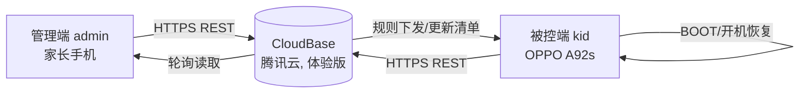

# PhoneGuard 数据流图（阶段五：隐私技术审计）

> 审计时间：2026-08-14
> 范围：管理端（:admin）↔ CloudBase ↔ 被控端（:kid）三方数据流。

## 1. 总体架构

## 2. 逐链路数据流明细

### 链路 1：kid → CloudBase（被控端上报）

| 数据 | 载体 | 集合 | 频率 | 内容 |
|---|---|---|---|---|
| 匿名身份 | x-device-id 请求头 → 匿名登录 | （auth） | 登录时 | 本地随机 16 位 deviceId（卸载重装变化） |
| 使用报告心跳 | upsertHeartbeat | usage | 60–120s | 日期、byPackage{包名:分钟}、totalMinutes、currentApp、权限健康状态（用量/无障碍/悬浮窗/自启动/设备管理器） |
| 已装应用列表 | upsert | apps | 规则页选择时 | 包名+应用名列表（经 InstalledAppFilter 过滤系统/异常包） |
| 异常事件 | report | events | 触发时 | 类型（TIME_CHANGED/NEW_APP/ADMIN_DISABLED/权限被关等）、消息文本、时间、状态（OPEN/ACK/RESOLVED） |
| 更新回执 | — | （无集合，本地） | 更新后 | 本地 UpdateDeliveryStore（版本/状态/失败原因） |

### 链路 2：admin → CloudBase（管理端操作）

| 数据 | 载体 | 集合 | 频率 | 内容 |
|---|---|---|---|---|
| 账号注册/登录 | CloudBaseAuth | users（平台托管） | 首次/每次 | 邮箱、用户名、密码（HTTPS 加密传输，腾讯云托管） |
| 邀请码生成/查询 | generateInviteCode / getMyInviteCode | bindings | 手动 | adminUid、6 位邀请码、状态 |
| 规则保存 | saveRules | rules | 手动 | adminUid、appLimits（包名/类别/分钟）、categoryLimits、dailyTotal、version |
| 轮询异常 | fetchUnread | events | 30s | 被控端事件 |
| 报告查询 | fetchLatest / fetchApps | usage / apps | 打开页面 | 被控端数据 |

### 链路 3：CloudBase → kid（下发）

| 数据 | 载体 | 频率 | 内容 |
|---|---|---|---|
| 规则同步 | fetchRules + 本地 RuleCacheStore | 心跳后/变更后 | 规则集（含 envelope 临时加时） |
| 更新清单 | GET update-manifest.json + APK | 周期检查/手动 | 版本、URL、SHA-256、ECDSA 签名（经验证后安装） |

### 链路 4：本地存储（不发云端）

| 端 | 内容 | 位置 |
|---|---|---|
| admin | accessToken/refreshToken/userId/username | SharedPreferences（明文，见安全审计 M1） |
| kid | deviceId/inviteCode/boundAdminUid/规则缓存/更新状态/拦截记录 | SharedPreferences / 内部文件 |
| kid | 无障碍页面分类、防护尝试记录 | ProtectionAttemptStore（本地） |

## 3. 传输安全

- 全部 HTTPS（CloudBase REST 泛域名）；无明文回退、无第三方跟踪 SDK、无广告 SDK、无埋点 SDK。
- 唯一外部依赖：腾讯云 CloudBase（认证、数据库、静态托管）。

## 4. 数据保留与删除现状（含缺口）

| 项 | 现状 | 缺口 |
|---|---|---|
| 账号注销 | 无客户端入口 | ⚠️ 需提供（政策承诺 + 支持渠道） |
| 数据删除 | 无客户端入口；控制台可删 | ⚠️ 需提供（政策承诺删除流程） |
| 解绑后数据 | bindings 保留历史（status=BOUND），usage/events/apps 保留 | ⚠️ 政策需明确保留期限与删除方式 |
| 本地数据 | 卸载即清除（allowBackup=false） | ✅ |
| 测试数据 | CloudBaseVerifyTest 用后清理 | ✅（控制台复核） |

## 5. 门禁结论（阶段五技术侧）

- [x] 数据流已绘制（4 链路全明细）
- [x] 数据清单、目的、保存、访问、删除现状已记录（见 PRIVACY_DATA_INVENTORY.md）
- [x] 权限最小化已核（见 PERMISSION_MATRIX.md）
- [x] 日志脱敏已核（无邮箱/密码/token 全文输出；DiagActivity 截断展示）
- [x] 传输安全已核（全 HTTPS，无第三方追踪）
- [ ] 删除/注销机制缺口 → 隐私政策如实声明 + 提供支持渠道（阶段六/七落实）
